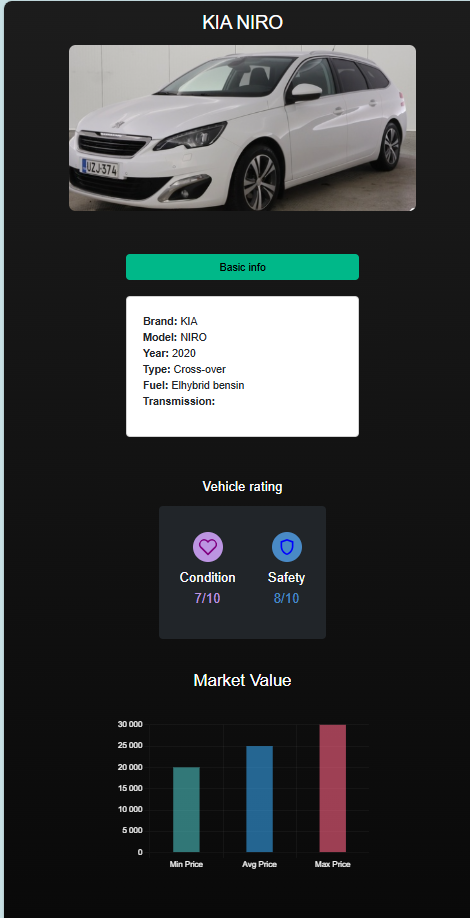

🌟 Features
🔍 Smart Vehicle Lookup - Search by license plate and country

📊 Comprehensive Reports:

📋 Basic specifications (make, model, year)

💰 Market value with interactive price charts

⚠️ Common issues with severity indicators

⭐ Health and safety ratings (1-10 scale)

📱 Fully Responsive - Perfect on mobile, tablet & desktop

🎨 Modern UI - Sleek design with smooth animations

🛠️ Tech Stack
Frontend	Backend	APIs
React.js	Node.js	RegCheck API
Bootstrap 5	Express	OpenAI API
Chart.js		
React Router		
🚀 Quick Start
Clone the repo

bash
git clone https://github.com/yourusername/vehicle-info-dashboard.git
cd vehicle-info-dashboard
Install dependencies

bash
npm install
Configure environment

bash
echo "REACT_APP_REGCHECK_USER=your_username\nREACT_APP_OPENAI_API_KEY=your_key" > .env
Run the app

bash
npm start
🏗️ Project Structure
bash
src/
├── assets/               # Images & icons
├── components/           # Reusable components
│   ├── IssueBlob.jsx     # Common issues display
│   ├── PriceBlob.jsx     # Interactive price chart
│   └── VehicleHealthBlob.jsx  # Health indicators
├── pages/
│   ├── Home.jsx          # Search interface
│   ├── InfoScreen.jsx    # Main dashboard
│   └── LoadingScreen.jsx # Animated loader
├── styles/               # Custom CSS
├── App.js                # Root component
└── index.js              # Entry point

🤝 Contributing
We welcome contributions! Please:

Fork the repository

Create your feature branch

Commit your changes

Push to the branch

Open a pull request